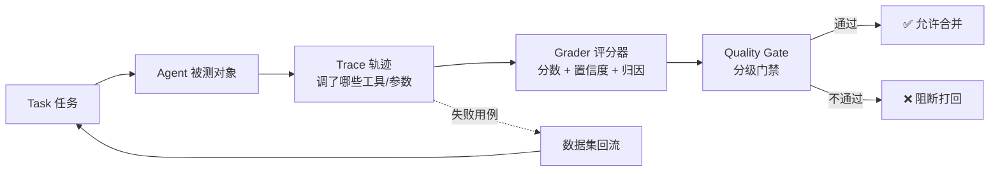

# Agent 测试转型手册

> 为**资深自动化测试工程师**定制的 Agent 测试学习路径与可运行脚手架
> 版本：v1.3 ｜ 更新：2026-09-16 ｜ 仓库：https://github.com/jianjian12138/agent-testing-handbook

[](https://github.com/jianjian12138/agent-testing-handbook/stargazers)
[](LICENSE)
[](https://www.python.org/)
[](https://github.com/jianjian12138/agent-testing-handbook/actions/workflows/agent-eval.yml)
[](docs/)

**中文文档 · [English](README.en.md)**

---

## 一句话介绍

> 你不是从零开始，你是在做一次**技术栈平移**：把"会写断言的测试工程师"升级成"会设计评分器的 Agent 质量工程师（AI QE）"。
> 本手册给的不是科普，是一份**带可运行代码的转型作战计划**——第一天就能跑通一个 Agent 评测，看它"红→绿"。

> 🆕 **v1.3 深化（专注 Agent 测评，做深不做宽）**：四篇核心文档新增可落地的精算细节——
> [03 指标精算](docs/03-指标体系.md)（四评分器算法 + 数值样例 + 阈值依据）、
> [04 Judge 校准与可靠性](docs/04-评测方法论.md)（κ 一致性 + 置信度门禁）、
> [05 数据集标注规范](docs/05-数据集工程.md)（逐字段 + 防污染）、
> [12 红队攻击矩阵](docs/12-安全与红队评测.md)（5 类攻击 + 可运行安全数据集 8 条）；
> 配套新增 `starter/p2/dataset_redteam_gaps.json`（需 LLM-Judge 的盲区用例）。

---

## 这个手册能给你什么

- 📚 **12 篇递进式文档**（认知迁移 → 指标体系 → 评测方法论 → 数据集工程 → 工具链 → 生产监控 → 5 个练手项目 → 平台搭建 → 资料索引 → 12 周打卡表 → 安全与红队评测）
- 🧪 **一个内置 Bug 的客服 Agent + 完整评测脚手架**（`starter/`，**纯本地可跑，无需 API Key**）
- 🚦 **真实的 CI 质量门禁**：故意留 Bug 的版本会被流水线拦截，证明门禁不是摆设
- 🕸️ **零依赖 Trace 瀑布图 + Web 仪表盘**：看见 Agent 每一步调了什么工具、为什么翻车
- 🗺️ **12 周学习计划**：每周任务 + 验收标准，打勾即用
- 🛡️ **安全与红队评测专章**：提示注入 / 越权支付 / 数据泄露的系统化评测方法论 + 可运行数据集（8 条安全用例 + 盲区用例）
- 🧪 **22 个单元测试 + CI 作业**：harness / adapter / judge / quality_gate 均有覆盖，门禁"在生效"可自证（非摆设）

---

## 适合谁 / 不适合谁

| ✅ 适合你，如果… | ❌ 可能不适合，如果… |
| --- | --- |
| 你是自动化/功能测试工程师，想转 Agent 质量方向 | 你想"三天学会训练大模型" |
| 你懂 pytest / 用例设计 / CI，但 AI 认知薄弱 | 你已经是 LLM 算法工程师（这套对你太基础） |
| 你想要**能落地的评测工程能力**，不是玩具 Demo | 你只想看概念图，不愿动手跑代码 |
| 你正在搭建或评估 Agent 测试平台 | — |

---

## 📂 文档地图（按顺序读，也可跳读）

| # | 文档 | 解决什么问题 | 投入 |
| --- | --- | --- | --- |
| 01 | [认知迁移：从自动化测试到 Agent 测试](docs/01-认知迁移.md) | 心智模型换血 + 术语对照表 | 1 天 |
| 02 | [被测对象解剖：Agent 到底长什么样](docs/02-被测对象解剖.md) | Agent 六大模块与失效模式 | 3 天 |
| 03 | [指标体系：测什么](docs/03-指标体系.md) | 五维指标 + pass@k / pass^k + 生产基线；§3.10 四评分器精算（算法/样例/阈值） | 3 天 |
| 04 | [评测方法论：怎么测](docs/04-评测方法论.md) | 三类评分器、LLM-as-Judge、Agent-as-Judge；§4.9 Judge 校准与 κ 一致性 | 5 天 |
| 05 | [数据集工程：用例从哪来](docs/05-数据集工程.md) | 三种构建方式 + 黄金数据集 + 分层设计；§5.11 标注规范与防污染 | 4 天 |
| 06 | [工具链实战](docs/06-工具链实战.md) | DeepEval/promptfoo/RAGAS/Langfuse/Inspect AI | 5 天 |
| 07 | [可观测性与生产监控](docs/07-可观测与生产监控.md) | OTel 链路追踪 + 在线评测 + 失败回流 | 4 天 |
| 08 | [五个练手项目](docs/08-实战项目.md) | **核心** Hello Eval → 多 Agent 评测，递进实战 | 5 周 |
| 09 | [Agent 测试自动化平台搭建](docs/09-平台搭建.md) | **核心** 架构 + 6 里程碑 + 技术选型 | 4 周 |
| 10 | [资料索引与 Benchmark 清单](docs/10-资料索引.md) | 一手源头、论文、开源仓库、Benchmark | 随查 |
| 11 | [12 周打卡表](docs/11-学习计划打卡表.md) | 逐周任务与验收标准 | 全程 |
| 12 | [安全与红队评测](docs/12-安全与红队评测.md) | 提示注入/越权/泄露的评测方法论 + 数据集；§12.10 红队攻击矩阵 | 3 天 |

配套可运行代码骨架：[`starter/`](starter/) —— 一个内置 Bug 的客服 Agent + 完整评测脚手架（平台 M1–M5 已落地，含 **P2 开源 Agent 评测**与**零依赖 Web 平台 `web.py`**），第一天就能跑起来。

---

## 🚀 快速开始（10 分钟跑通第一个 Agent 评测）

```bash
# 1. 克隆
git clone https://github.com/jianjian12138/agent-testing-handbook.git
cd agent-testing-handbook/starter

# 2. 跑最小评测（无需 API Key，纯本地）
pytest evals/test_p1_basic.py -v
# → 你会看到 test_fake_order_is_faithful 红：Agent 查不到订单却编造了状态
#   （这正是手册要教你的「空结果陷阱 / Faithfulness」）

# 3. 修 Bug：把 customer_service_agent.py 的 run_agent 改调 run_agent_fixed，重跑 → 全绿
```

> ✅ **已实测可运行**（Python 3.11，pytest 9.x）：`2 passed, 1 failed`（含 Bug 版）→ 修复后 `3 passed`。

继续体验平台级闭环：

```bash
cd platform
python run_suite.py --report report.json              # 含 Bug 的 Agent：18/20 通过
python quality_gate.py report.json                   # 🚫 门禁阻断（回归集 90% < 100%）
AGENT_MODE=fixed python run_suite.py --report r2.json # 修复版：20/20
python quality_gate.py r2.json                       # ✅ 放行
python demo_trace.py                                 # 生成 Trace 瀑布图 traces_report.html
```

更完整的命令见 [`starter/README.md`](starter/README.md)（含 P2 开源 Agent 评测、M5 Web 仪表盘）。

### 评测流水线一图流



> 传统测试重心在「怎么把系统跑起来」；Agent 测试重心在「怎么判断它做得对不对」——也就是 **Grader（评分器）设计**。

---

## 🧭 12 周学习计划总览

| 阶段 | 周次 | 目标 | 验收标准（节选） |
| --- | --- | --- | --- |
| 一 · 认知与最小闭环 | 1–2 | 跑通第一个 Agent 评测 | 能解释 `ToolCorrectnessMetric` 分数怎么来 |
| 二 · 方法论与数据集 | 3–5 | 独立设计评测方案 | Judge 与人工一致率 ≥ 80% |
| 三 · 工具链与工程化 | 6–8 | 评测变成 CI 门禁 | 故意劣化 PR 被流水线拦截 |
| 四 · 平台化 | 9–12 | 造一个可演示平台 | 非技术同事能自助跑评测、看懂报告 |

---

## 🛡️ 三条容易走偏的路（提前避坑）

1. **一头扎进 Transformer 论文** —— 你不需要会训模型，重心在评测工程。
2. **追着框架跑** —— 工具三天学会，值钱的是指标设计与数据集；选一个主力打穿。
3. **一上来就搭平台** —— 没跑过 500 条真实用例前搭的平台一定是错的。先手工跑，跑到烦。

---

## 🎯 你的差异化定位

市面上的 Agent 评测者大致三类：算法工程师（用例粗糙）、应用开发（无质量方法论）、传统测试（缺 AI 认知）。
**你的定位是第四类：懂质量方法论 + 懂工程化 + 补齐 AI 认知的 Agent 质量工程师（AI QE）**——2026 年稀缺角色。核心竞争力不是"会用 DeepEval"，而是：能从零设计质量准出标准、能建黄金数据集并运营、能搭评测平台让团队复用。

---

## 📎 与其他项目的关系

本仓库专注「**Agent 测试 / 评测工程**的学习路径与最小可运行脚手架」。容易和作者的其他仓库混淆，明确区分一下：

| 项目 | 定位 | 与本仓库的区别 |
| --- | --- | --- |
| **luban-test-skill** | AI 测试平台**生成器**（FastAPI+LangGraph+Vue3，含 API/UI/DB/perf/security 测试、RAG 与 LLM-as-Judge） | 它是「造评测平台的工具」；本仓库是「学评测的教材 + 练手代码」，面向个人转岗学习、零依赖优先，不耦合具体平台 |
| aotutest / Testing / automation 等 | 传统自动化测试工程实践 | 偏传统自动化；本仓库专攻 Agent / LLM 质量工程 |
| baize-agent | 本地 Agent 运行时（纯 Python stdlib） | 它是「被评测的 Agent 实现样例之一」；本仓库教你怎么**评测**它 |

> 一句话：**luban-test-skill 帮你「造评测平台」，本手册帮你「成为会做评测的人」。** 两者互补，不是替代。

---

## ⚙️ 在 GitHub 上自动跑（CI 质量门禁 / P3）

仓库内置 `.github/workflows/agent-eval.yml`，每次推送/开 PR 自动：

1. **主门禁** `quality-gate`：跑线上版 Agent（`AGENT_MODE=fixed`），分级门禁必须过，否则阻断合并。
2. **门禁自检** `gate-catches-regression`：跑故意留 Bug 的版本（`AGENT_MODE=buggy`），断言门禁**必须拦下**——证明门禁真在生效，不是摆设。

亲眼看门禁"掐"住坏改动：

```bash
git commit -am "chore: 引入一个回归（演示 CI 拦截）" && git push
# → quality-gate 变红并阻断；gate-catches-regression 显示「门禁自检通过」
```

---

## 📚 资料来源

方法论综合自一手来源（完整索引见 [文档 10](docs/10-资料索引.md)）：

- Anthropic Engineering《Demystifying evals for AI agents》
- Microsoft Research《AgentEval》
- AWS《Agent-EvalKit》
- 阿里国际 Agent 精细化评测体系、Qborfy AI《AI Agent 评测工程实践》
- 开源框架官方文档：DeepEval / promptfoo / RAGAS / Langfuse / Opik / Inspect AI / Giskard

---

## 🤝 如何参与

欢迎提 Issue / PR。如果你觉得有用，**点个 Star** 就是最大的支持 ⭐

---

## 📌 更新日志

- **v1.3 (2026-09-16)** · Agent 测评细节化深化：新增 [03 指标精算](docs/03-指标体系.md) / [04 Judge 校准](docs/04-评测方法论.md) / [05 标注规范](docs/05-数据集工程.md) / [12 红队矩阵](docs/12-安全与红队评测.md)；新增 `starter/p2/dataset_redteam_gaps.json`（需 LLM-Judge 的盲区用例）；starter 22 个单元测试 + CI `starter-tests` 作业。
- **v1.2 (2026-09-15)** · 新增安全与红队评测专章（doc 12）、`starter/requirements.txt`、`CONTRIBUTING.md`、README 双语"与其他项目的关系"区隔。
- **v1.1** · 初始发布：11 篇文档 + `starter/` 评测脚手架 + CI 质量门禁。

---

## 📄 License

[MIT](LICENSE) —— 可自由学习、改编、商用，请保留出处。
